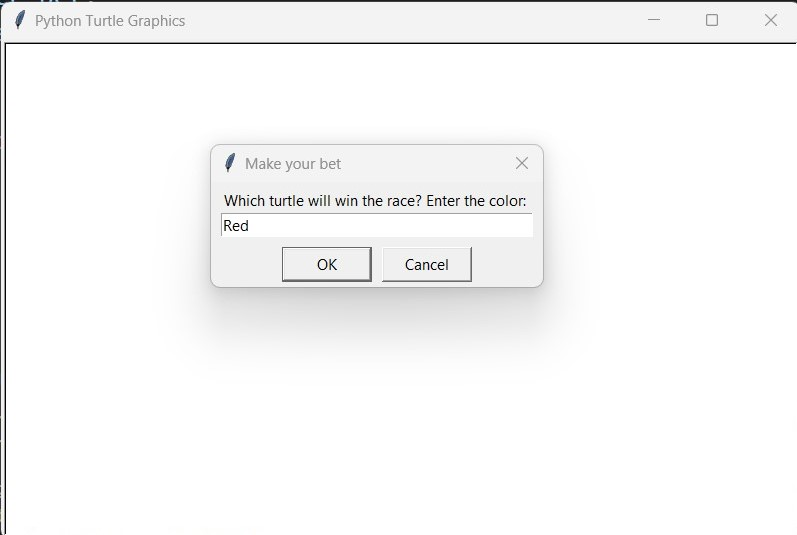
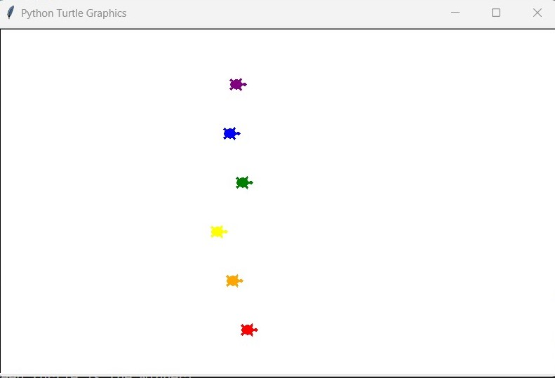
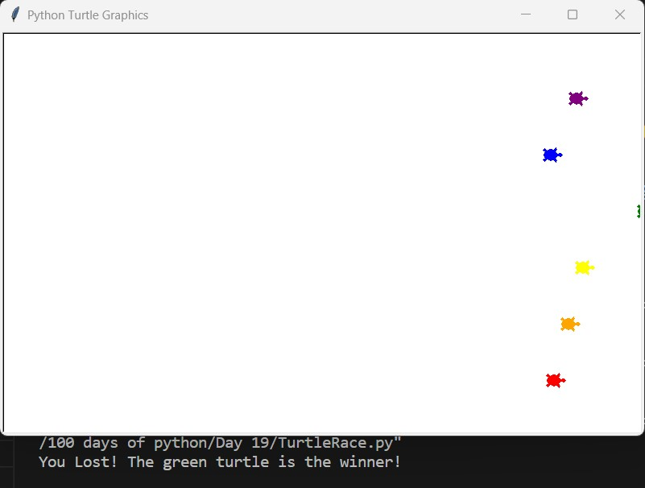

# Turtle Race Game

## Description

Turtle Race Game is a simple Python game created as part of the "100 Days of Python" course. It's a fun and interactive game where player can bet on different colored turtles and watch them race across the screen using the Turtle graphics library.

## Features

- Choose your favorite turtle: Players can choose their preferred turtle to place bets on before the race begins.

- Place bets: Players have the option to place bets on the turtle they think will win the race.

- Race animation: The turtles move across the screen in a race animation, creating an engaging and interactive experience.

- Winner announcement: The game declares the winning turtle after the race and displays whether the player's bet was successful.

## How to Play

1. Run the `TurtleRace.py` script using a Python interpreter.
2. Follow the on-screen instructions to choose a turtle and place your bet.
3. Watch the race animation and see if your turtle wins!
4. The game will announce the winner and let you know if your bet was correct.

## Screenshots

## Requirements

- Python 3.x
- Turtle graphics library (usually included in standard Python installations)

## Usage

1. Clone or download this repository to your local machine.
2. Open a terminal or command prompt.
3. Navigate to the project directory.
4. Run the following command to start the game: `TurtleRace.py`
